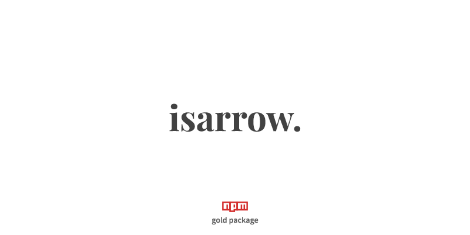

<p align="center">
    <a href="#install" alt="isArrow">
        
    </a>
</p>

<p align="center">
    <a href="https://github.com/nof1000/isclass">isclass</a>
    <strong>&emsp;&bull;&emsp;</strong>
    <strong>isarrow</strong>
    <strong>&emsp;&bull;&emsp;</strong>
    <a href="https://github.com/nof1000/isasync">isasync</a>
</p>

## What it's for?
This is Node.js library that checks whether a value is an arrow function


## Install
npm:
```
$ npm install isarrow --save
```

yarn:
```
$ yarn add isarrow
```


## Example
```js
const isArrow = require('isarrow');

console.log(isArrow("hello world")); // > false
console.log(isArrow(function() {})); // > false
console.log(isArrow(async function() {})); // > false
console.log(isArrow(class {})); // > false
console.log(isArrow(() => {})); // > true
console.log(isArrow(async () => {})); // > true
console.log(isArrow(123)); // > false
console.log(isArrow({})); // > false
console.log(isArrow([])); // > false
```


## LICENSE
[MIT](./LICENSE "The MIT License")
